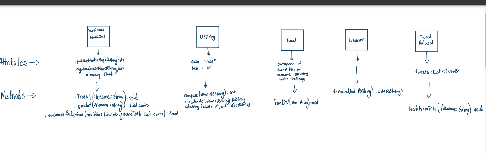

# Assignment 2: Answers

**Complete this document, commit your changes to Github and submit the repository URL to Canvas.** Keep your answers short and precise.

Your Name:

Used free extension: [ ] 24 hrs or [ ] 48 hrs

[ ] Early submission (48 hrs)

[ ] Bonus work. Describe: ...

Place [x] for what applies.

## UML Diagram

Add your UML class diagram here.

Replace the following image with your diagram. You can draw it by hand and take a photo.
ss.png)

## Answers

1. How do you train the model and how do you classify a new tweet? Give a short description of the main steps.

    > The file first opens and reads the date and is labeled. Then the tweets are all tokenized into indiviual words and we filter out the special characters. We then update the word count if it is positive or negative. Then we calculate the word probabilities and store those in mapSen.

2. How long did your code take for training and what is the time complexity of your training implementation (Big-Oh notation)? Remember that training includes reading the tweets, breaking it into words, counting, ... Explain why you get this complexity (e.g., what does `N` stand for and how do your data structures/algorithms affect the complexity).

   > THe training period for us took a week. TIme complexity for training implementaiton is O(N * V) in which it is tweets and average number of words per tweet.

3. How long did your code take for classification and what is the time complexity of your classification implementation (Big-Oh notation)? Explain why.

   > This code took a week to classify. Classification implementation time complexity is described as O(V)  per tweet.

4. What accuracy did your algorithm achieve on the provides training and test data? 

   > My accuracy: 72.1%

   The TA will run your code on Linux and that accuracy value will be used to determine your grade.

5. What were the changes that you made that improved the accuracy the most?
   
   > I would say the decreasing the amount that the word appear and whether it was revelant to the positive and negative count. Initially I put 12 but found out lower to 6 is more efficient.

6. How do you know that you use proper memory management? I.e., how do you know that you do not have
   a memory leak?

   > Dynamically allocated memory should be discharcehd after use. Alco using maps and vectors help reduce manual memory management issues.

6. What was the most challenging part of the assignment?

   > Honesly, it was not having something like "First you have to..." inside the instructions. It was very overwhelming not knowing where to start. The next hard thing was transfering the functions and renaming them to have useful varibales.